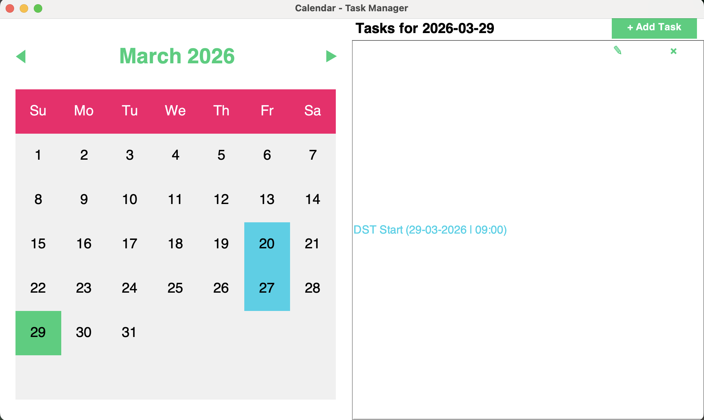

# Calendar App

A Java Swing calendar and task manager.



## Download (Linux)

Go to [Releases](../../releases) and download `CalendarApp-x86_64.AppImage`.

```bash
chmod +x CalendarApp-x86_64.AppImage
./CalendarApp-x86_64.AppImage
```

No Java installation required — the JRE is bundled inside.

## Other Platforms

Download `CalendarApp.jar` from Releases. Requires Java 17+.

```bash
java -jar CalendarApp.jar
```

## Build from Source

Requires JDK 17+ and Maven.

```bash
git clone https://github.com/Mayank141-web/Calendar-App.git
cd Calendar-App
mvn clean package
java -jar target/CalendarApp.jar
```

## Release a New Version

```bash
git tag v1.0.0
git push --tags
```

GitHub Actions will automatically build and publish the AppImage to Releases.
